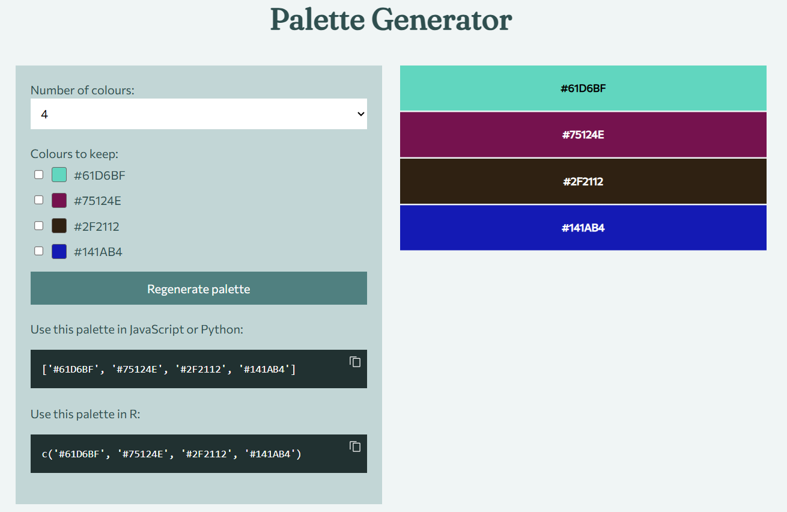

# Palette Generator App

This repository contains the source code for an app to generate a random color palette. The app is built using {shiny} in R, and is hosted via GitHub Pages using `shinylive`.

